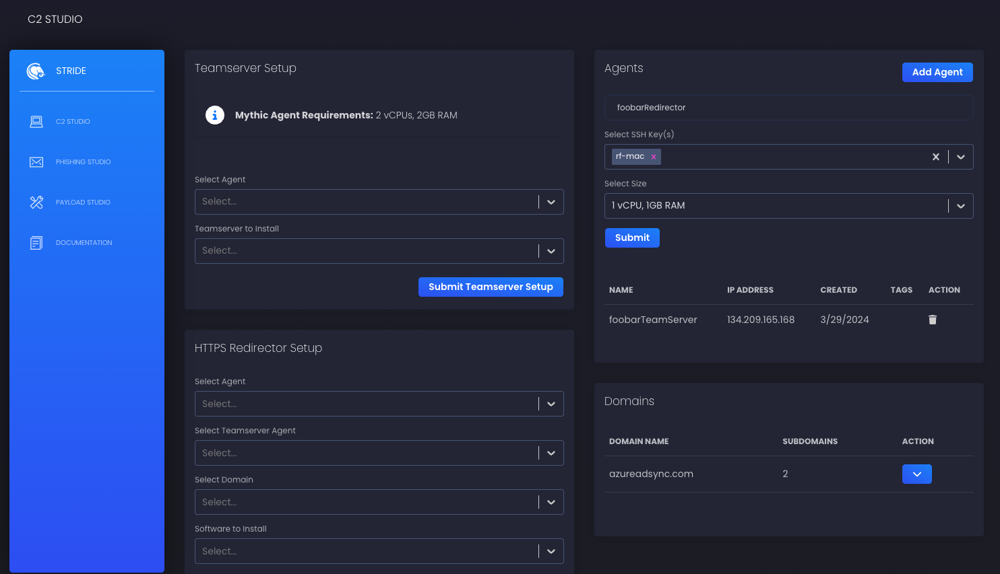

# Stride: React Fast to SOCs in Stride

Stride is a powerful open-source tool designed to simplify and streamline the process of setting up and managing red team infrastructure. With Stride, you can easily create, deploy, and tear down various components of your offensive security environment, all with just a few clicks.

## Dashboard Screenshot
<p align="center">
   
</p>

## Features

- Seamless integration with Digital Ocean API for managing droplets (agents) and DNS records
- Rapid deployment of teamservers (Sliver, Mythic, Havoc C2) and redirectors (Apache) on Digital Ocean droplets
- Intuitive interface for setting up and managing phishing campaigns using EvilGoPhish
- Flexible and extensible framework for deploying payloads using Shhhloader
- Comprehensive logging system with different log levels and real-time monitoring via WebSocket
- Modular architecture for easy integration of new teamserver software, redirectors, and payloads
- Community-driven and open-source, allowing for collaboration and continuous improvement

## Getting Started

To get started with Stride, follow these steps:

1. Clone the Stride repository from GitHub:

   ```bash
   git clone https://github.com/loosehose/stride.git
   ```

2. Install the necessary dependencies. Stride requires Go and Node.js to be installed on your system. Run the following commands:

   ```bash
   cd stride/stride-ui
   npm i
   ```

3. Configure your Digital Ocean API token. Stride uses the Digital Ocean API to manage droplets and DNS records. Make sure to set your API token in the configuration file or environment variable.

4. Build and run the Stride backend:

   ```bash
   cd stride-server
   go build -o stride-server ./cmd/api/
   ./stride-server
   ```

5. Start the Stride Application:

   ```bash
   cd stride-ui
   npm run build:<os>
   ```

## API Documentation

Stride provides a RESTful API for interacting with the backend. Here are some of the key API endpoints:

- `POST /teamserver-setup`: Set up a teamserver on a specified agent.
- `POST /redirector-setup`: Set up a redirector on a specified agent.
- `POST /phishing-setup`: Set up a phishing campaign.
- `POST /payload-setup`: Deploy a payload to a target system.
- `GET /agents`: Retrieve a list of all agents (droplets).
- `POST /agents`: Create a new agent (droplet).
- `DELETE /agents/:id`: Delete an agent (droplet) by ID.
- `GET /domains`: Retrieve a list of all domains and subdomains.
- `POST /subdomains`: Create a new subdomain.
- `DELETE /subdomains/:domain/:subdomain`: Delete a subdomain.

## Deployment Functions

Stride provides a set of deployment functions that handle the setup and configuration of various components. Here are some of the key deployment functions:

- `DeploySliverTeamserver`: Deploys a Sliver teamserver on the specified agent.
- `DeployMythicTeamserver`: Deploys a Mythic teamserver on the specified agent.
- `DeployHavocC2Teamserver`: Deploys a Havoc C2 teamserver on the specified agent.
- `DeployApacheRedirector`: Deploys an Apache redirector on the specified agent.
- `DeployPhishingCampaign`: Sets up a phishing campaign with the specified parameters.
- `DeployPayload`: Creates a payload using Shhhloader.

These deployment functions are implemented in the backend and can be easily extended or modified to support additional software or configurations.

## Payload Setup and Deployment

Stride provides a user-friendly interface for setting up and deploying custom payloads on Digital Ocean droplets (agents). Stride is integrated with Shhhloader as it is continuously updated and considered moderately evasive to today's security solution. This section explains how to configure and deploy payloads using the Stride frontend and backend API.

### Frontend Interface

The Stride frontend offers an intuitive interface for configuring payload options and selecting the target agent for deployment. The payload setup page includes the following fields:

- **Shellcode Path**: The path to the shellcode file (`.bin`) on the agent. The shellcode file must be stored on the agent prior to deployment.
- **Process to Inject Into**: The process that the shellcode will be injected into (e.g., `explorer.exe`, `notepad.exe`).
- **Method for Shellcode Execution**: The method used for executing the shellcode (e.g., `PoolPartyModuleStomping`, `PoolParty`, `ThreadlessInject`, `ModuleStomping`, `QueueUserAPC`, `ProcessHollow`, `EnumDisplayMonitors`, `RemoteThreadContext`, `RemoteThreadSuspended`, `CurrentThread`).
- **Unhook NTDLL**: Whether to unhook NTDLL functions before executing the shellcode.
- **Sandbox Argument**: Additional arguments for the sandbox environment (optional).
- **Syscall Execution Method**: The method used for executing syscalls (e.g., `SysWhispers2`, `SysWhispers3`, `GetSyscallStub`, `None`).
- **Generate DLL**: Whether to generate a DLL payload.
- **Output File**: The path and filename for the generated payload (optional).
- **Select Agent**: The target agent (droplet) where the payload will be deployed.

The frontend interface also includes an information box with the following details:

- The shellcode file (`.bin`) must be stored on the agent prior to deployment.
- The agent requirements for payload deployment: 2 vCPUs and 4GB RAM.

### Backend API

The Stride backend provides an API endpoint for handling payload setup and deployment requests:

- `POST /payload-setup`: Deploys a payload to the specified agent with the provided configuration options.

#### Request Payload

The request payload for the `/payload-setup` endpoint should include the following fields:

```json
{
  "agentIP": "192.0.2.1",
  "shellcodePath": "/path/to/shellcode.bin",
  "process": "explorer.exe",
  "method": "PoolParty",
  "unhookNtdll": true,
  "syscall": "SysWhispers2",
  "dll": false,
  "outfile": "/path/to/output.exe",
  "sandboxArg": "domain.local, machine.domain.local, username"
}
```

#### Deployment Logic

When the `/payload-setup` endpoint receives a request, the following steps are performed:

1. The request payload is decoded into a struct containing the payload configuration options.
2. The `DeployShhhloader` function is called with the following parameters:
   - `wsm`: A pointer to the `WebSocketManager` instance for sending log messages.
   - `agentIP`: The IP address of the agent where the payload will be deployed.
   - `shellcodePath`: The path to the shellcode file on the agent.
   - `user`: The SSH username (default is "root").
   - `privateKeyPath`: The path to the private key file used for SSH authentication.
   - `commandLineOptions`: The command line options for the Shhhloader payload, constructed based on the provided configuration options.
3. Inside the `DeployShhhloader` function:
   - The necessary commands to clone the Shhhloader repository, install dependencies, and execute the payload are defined.
   - The `deployPayload` function is called with the appropriate parameters to execute the commands on the agent over SSH.
4. Inside the `deployPayload` function:
   - An SSH connection is established with the agent using the provided connection details.
   - The total number of commands to be executed is determined.
   - Each command is executed on the agent over the SSH connection.
   - Progress messages are sent to the frontend using the `WebSocketManager` to indicate the current step.
   - If any command fails, an error message is logged and sent to the frontend, and the function returns an error.
5. If the deployment is successful, a success message is logged and sent to the frontend.

## Phishing Setup and Deployment 

Stride provides functionality to set up and deploy phishing infrastructure on Digital Ocean droplets (agents). This document explains how to configure and deploy phishing campaigns using the Stride frontend and backend API.

### Frontend Interface 

The Stride frontend offers an intuitive interface for configuring phishing options and selecting the target agent and domain for deployment. The phishing setup page includes the following fields: 

- **Select Agent**: target agent (droplet) where the phishing infrastructure will be deployed.
- **Select Root Domain**: The root domain to be used for the phishing campaign.
- **Subdomains**: A space-separated list of subdomains to be created for the phishing campaign.
- **Proxy Root Domain to EvilGoPhish**: Whether to proxy the root domain to EvilGoPhish.
- **Redirect URL**: The URL to redirect users to after they submit their credentials.
- **Use Live Feed**: Whether to use a live feed for the phishing campaign.
- **RID Replacement**: The replacement value for the RID (Recipient ID) in the phishing emails.
- **Use Apache Blacklist**: Whether to use the Apache blacklist for blocking certain IP addresses. 

### Backend API 

The Stride backend provides an API endpoint for handling phishing setup and deployment requests: 

- `POST /phishing-setup`: Sets up and deploys the phishing infrastructure on the specified agent with the provided configuration options. 

#### Request Payload 

The request payload for the `/phishing-setup` endpoint should include the following fields: 

```json
{ 
	"agentIP": "192.0.2.1", 
	"rootDomain": "example.com", 
	"subdomains": ["www", "login", "account"], 
	"rootDomainBool": "true", 
	"redirectUrl": "https://example.com/redirect", 
	"feedBool": "true", 
	"ridReplacement": "user_id", 
	"blacklistBool": "false" 
}
```

### Deployment Logic

When the `/phishing-setup` endpoint receives a request, the following steps are performed:

1. The request payload is decoded into a struct containing the phishing configuration options.
2. The `DeployEvilGoPhish` function is called with the following parameters:
   - `wsm`: A pointer to the `WebSocketManager` instance for sending log messages.
   - `agentIP`: The IP address of the agent where the phishing infrastructure will be deployed.
   - `user`: The SSH username (default is "root").
   - `privateKeyPath`: The path to the private key file used for SSH authentication.
   - `rootDomain`: The root domain for the phishing campaign.
   - `subdomains`: An array of subdomains to be created.
   - `rootDomainBool`: Whether to proxy the root domain to EvilGoPhish.
   - `redirectURL`: The URL to redirect users to after they submit their credentials.
   - `feedBool`: Whether to use a live feed for the phishing campaign.
   - `ridReplacement`: The replacement value for the RID in the phishing emails.
   - `blacklistBool`: Whether to use the Apache blacklist for blocking certain IP addresses.
3. Inside the `DeployEvilGoPhish` function:
   - An SSH connection is established with the agent using the provided connection details.
   - The necessary commands to set up and deploy the phishing infrastructure are executed on the agent over SSH.
   - Progress messages are sent to the frontend using the `WebSocketManager` to indicate the current step.
   - If any command fails, an error message is logged and sent to the frontend, and the function returns an error.
4. If the deployment is successful, the Gophish admin password and the TXT record for DNS validation are returned.

## Adding New Components

Stride is designed to be extensible, allowing you to easily add support for new teamserver software, redirectors, and payloads. To add a new component, follow these general steps:

1. Create a new deployment function in the appropriate package (e.g., `stride-server/internal/deployment/teamserver`).
2. Implement the necessary logic to set up and configure the new component.
3. Update the API handlers to support the new component.
4. Modify the frontend to include the new component in the user interface.

## Contributing

Stride is an open-source project, and contributions are welcome! If you'd like to contribute to Stride, please follow these steps:

1. Fork the Stride repository on GitHub.
2. Create a new branch for your feature or bug fix.
3. Make your changes and commit them with descriptive commit messages.
4. Push your changes to your forked repository.
5. Submit a pull request to the main Stride repository.

Please ensure that your code follows the project's coding conventions and includes appropriate documentation and tests.

## Acknowledgements

Stride would not be possible without the contributions of the open-source community and the various libraries and frameworks it builds upon. We would like to express our gratitude to all the developers and maintainers of these projects.

Happy red teaming with Stride!
